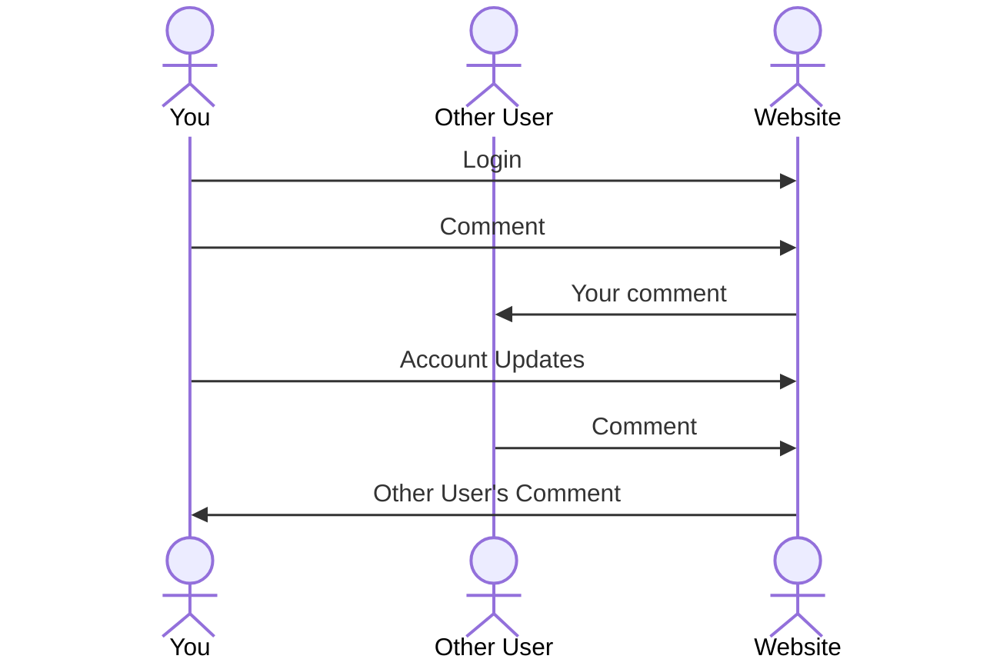

# Badreads (a book reviewing website)

[My Notes](notes.md)

My startup will be a book-reviewing website, named "badreads" as a play on the popular book website "goodreads," though there will not be any particular focus on negative reviews, as the name might suggest. The startup will provide a way to create and save a personal account, provide a list of books to review, allow comments to be made on any particular book, and will update average book scores in real time.

> [!NOTE]
>  This is a template for your startup application. You must modify this `README.md` file for each phase of your development. You only need to fill in the section for each deliverable when that deliverable is submitted in Canvas. Without completing the section for a deliverable, the TA will not know what to look for when grading your submission. Feel free to add additional information to each deliverable description, but make sure you at least have the list of rubric items and a description of what you did for each item.

> [!NOTE]
>  If you are not familiar with Markdown then you should review the [documentation](https://dohowzcs.github.com/en/get-started/writing-on-github/getting-started-with-writing-and-formatting-on-github/basic-writing-and-formatting-syntax) before continuing.

## 🚀 Specification Deliverable

> [!NOTE]
>  Fill in this sections as the submission artifact for this deliverable. You can refer to this [example](https://github.com/webprogramming260/startup-example/blob/main/README.md) for inspiration.

For this deliverable I did the following. I checked the box `[x]` and added a description for things I completed.

- [x] Proper use of Markdown
- [x] A concise and compelling elevator pitch
- [x] Description of key features
- [x] Description of how you will use each technology
- [x] One or more rough sketches of your application. Images must be embedded in this file using Markdown image references.

### Elevator pitch

Have you ever read a phenomenal book and just had to tell someone about it? Have you, like me, ever read a high school English book that was the most boring thing ever and just need to complain about it? Well, I've got the solution for you! Badreads is a great place to rave about (or complain about) your favorite (or least favorite) books!

### Design

The design will consist of 4 main pages: the login page, the home page, the review page, and the account page. The login page will have fields for a username and password, and login/register options. The home page will have a quote of the day and the list of books that are available for review. The review page will open when a book is selected for review, and will have the ratings, comments, and book information. The account page will have account details, including a username, password, and your past comments.

### Key features

- Allows comments and reviews on different books
- Updates in real time the list of comments on the books
- Updates in real time the average score for the books
- Randomly generates a quote each time the website is loaded
- Saves and displays your past comments
- Has a short description and information on the books
- Supports account updates

### Technologies

I am going to use the required technologies in the following ways.

- **HTML** - Uses correct HTML structure. Four pages: a login page, a home page, a review page, and an account page. Hyperlinks will be included to navigate the webpage smoothly.
- **CSS** - CSS will be used to style the webpage, and will include building a header with the website title and relevant links. It will also format the rest of the site to be visually appealing.
- **React** - React and JavaScript will provide reactability to the site, and will enable text fields such as the username, password, and book comment fields to be used. It will also provide functionality to the various buttons of the website, such as the login and register buttons on the login page.
- **Service** - Services provided will include displaying comments from other users and recalling the user's past comments on their account page. An outside API will be used to randomize quotes for the quote of the day.
- **DB/Login** - Login and account data will be persistently stored in a database, as well as information such as past comments and reviews. The database will also provide information necessary for calculating average review scores.
- **WebSocket** - WebSocket will facilitate the real time updates of other user's comments to the browser, as well as updating the average review score for each book in real time.

## 🚀 AWS deliverable

For this deliverable I did the following. I checked the box `[x]` and added a description for things I completed.

- [x] **Server deployed and accessible with custom domain name** - [My server link](https://zacksayshi.click).

To the TA grading my deliverable, could you please check my [notes.md](/notes.md) file to ensure that I have not accidentally included any sensitive information there? Thank you.

## 🚀 HTML deliverable

For this deliverable I did the following. I checked the box `[x]` and added a description for things I completed.

- [x] **HTML pages** - I created four html pages: [index.html](index.html), [home.html](home.html), [reviews.html](reviews.html), and [account.html](account.html). The index.html page includes the login fields for the user, the home.html displays the home page of the application, the reviews.html will be the page where you can leave a review on The Way of Kings, and account.html which will display account data like associated email and old comments.
- [x] **Proper HTML element usage** - I spent time figuring out what different HTML elements did, and made extensive use of header, footer, main, body, div, hr, span, form, input, and button, among others.
- [x] **Links** - I included links to the four main pages on every page of the startup, and linked some of the buttons to other pages. Pressing the "login" or "create" buttons will take you to the home page, and clicking the "review" button will take you to the reviews page.
- [x] **Text** - I included a large amount of text in my startup. There are textual indications of the titles and authors of the books on the home and review page, and the review page has additional textal elements including a summary of the book, page count, and placeholders for other's comments.
- [x] **3rd party API placeholder** - My 3rd party API will be a random quote generator that is displayed on the home page. For the time being, my home page displays a quote from my friend as a placeholder.
- [x] **Images** - I included images in the form of a favicon of a book, as well as images of the book covers for the two books that are currently on there.
- [x] **Login placeholder** - I used a form with email and password inputs as the login placeholder. It also includes login and create buttons that will take you to the home page.
- [x] **DB data placeholder** - The database data in my startup will take the place of the list of previous comments (now placeholders) on the review page, as well as being used to display your username and past comments on the account page.
- [x] **WebSocket placeholder** - The WebSocket placeholder is the average rating displayed on both the review and the home page, as well as the number of total ratings displayed on the review page. Eventually, these will update in real time.

## 🚀 CSS deliverable

For this deliverable I did the following. I checked the box `[x]` and added a description for things I completed.

- [x] **Header, footer, and main content body** - I styled the header and footer to have a blue background and display the information contained there prominently, and made these consistent across all pages, linking [main.css](main.css) to all pages.
- [x] **Navigation elements** - The main navigation for the website is contained in the header, with links to the login, home, reviews, and account pages. There is also navigation within the pages, such as the login or create buttons taking you to the home page, and the review button on the home page taking you to the reviews page.
- [x] **Responsive to window resizing** - The application is responsive to window resizing by the use of the flex element. In addition, when the screen size gets too small, it removes the header and footer. On the reviews page, if the screen size gets too small it removes the book cover image.
- [x] **Application elements** - Uses whitespace, spacing, background color, font color, and font sizing to create a pleasing look.
- [x] **Application text content** - Text content has a consistent font and look, and is displayed in locations that make sense and flow.
- [x] **Application images** - The book cover images were sized appropriately, and styled to be in the proper locations.

## 🚀 React part 1: Routing deliverable

For this deliverable I did the following. I checked the box `[x]` and added a description for things I completed.

- [x] **Bundled using Vite** - I used npm and vite to bundle the startup port it to react, as well as to deploy it to the server.
- [x] **Components** - I made jsx components for the login, home, reviews, and account pages. I also made an app.jsx for the top-level structure.
- [x] **Router** - I implemented routing in the app.jsx to route between the different login, home, reviews, and account pages.

## 🚀 React part 2: Reactivity

For this deliverable I did the following. I checked the box `[x]` and added a description for things I completed.

- [x] **All functionality implemented or mocked out** - All functionality for my startup has been implemented or mocked out. This includes login credentials (only username) stored in local storage and the ability to change the username (change password feature is temporarily disabled, as I am not storing passwords in local storage. This will be implemented with login credentials). It simulates WebSocket by randomly generating reviews, calculates the average score for the book in both the Home and Review pages, and only allows valid review scores.
- [x] **Hooks** - I made extensive use of `useState` hooks to update and render state variables, and I also made extensive use of `useEffect` hooks to automatically update average scores and the table of total scores (eventually to be replaced with WebSocket data), and to simulate WebSocket data by randomly generating a review every 8 seconds.

## 🚀 Service deliverable

For this deliverable I did the following. I checked the box `[x]` and added a description for things I completed.

- [ ] **Node.js/Express HTTP service** - I did not complete this part of the deliverable.
- [ ] **Static middleware for frontend** - I did not complete this part of the deliverable.
- [ ] **Calls to third party endpoints** - I did not complete this part of the deliverable.
- [ ] **Backend service endpoints** - I did not complete this part of the deliverable.
- [ ] **Frontend calls service endpoints** - I did not complete this part of the deliverable.
- [ ] **Supports registration, login, logout, and restricted endpoint** - I did not complete this part of the deliverable.

## 🚀 DB deliverable

For this deliverable I did the following. I checked the box `[x]` and added a description for things I completed.

- [ ] **Stores data in MongoDB** - I did not complete this part of the deliverable.
- [ ] **Stores credentials in MongoDB** - I did not complete this part of the deliverable.

## 🚀 WebSocket deliverable

For this deliverable I did the following. I checked the box `[x]` and added a description for things I completed.

- [ ] **Backend listens for WebSocket connection** - I did not complete this part of the deliverable.
- [ ] **Frontend makes WebSocket connection** - I did not complete this part of the deliverable.
- [ ] **Data sent over WebSocket connection** - I did not complete this part of the deliverable.
- [ ] **WebSocket data displayed** - I did not complete this part of the deliverable.
- [ ] **Application is fully functional** - I did not complete this part of the deliverable.
